#环境搭建

[官网下载](http://code.google.com/p/go/downloads/list)*可能被墙了*  
[golang中国下载](http://golangtc.com/)
选择自己想要的版本进行安装

##安装
在linux环境中Go默认会被安装到/usr/local/go目录中。安装包在安装完成后会自动添加执行 文件目录到系统路径中。
安装完成后，请重新启动命令行程序，然后运行下命令`go version`以验证Go是否已经正确安装  

###eclipse的golang插件
```
Installation

Requirements:

Eclipse 4.4 (Luna) or later.
A 1.7 Java VM or later (http://www.java.com/). Otherwise GoClipse will silently fail to start.
Go development tools and libraries installed on target machine (http://golang.org/doc/install.html). Currently, only the plan 9 style compilers are supported. GCCGO may be supported in the future
Instructions:
Use your existing Eclipse, or download a new Eclipse package from http://www.eclipse.org/downloads/.
For an Eclipse package without any other IDEs or extras (such a VCS tools), download the "Platform Runtime Binary".
Start Eclipse, go to Help -> Install New Software...
Click the Add... button, then enter the Update Site URL: http://goclipse.github.io/releases/ in the Location field, click OK.
Select the recently added update site in the Work with: dropdown. Type GoClipse in the filter box. Now the Goclipse feature should appear below.
Select the GoClipse feature, and complete the wizard.
Dependencies such as CDT will automatically be added during installation.
Restart Eclipse. After that take a look at the configuration section in the User Guide.
Updating:

If you already have GoClipse installed, and want to update it to a newer release, click Help -> Check for Updates...
```
[详情参见](https://github.com/GoClipse/goclipse/blob/master/documentation/Installation.md)

###GoClipse配置
1. 首先需要下载gocode 。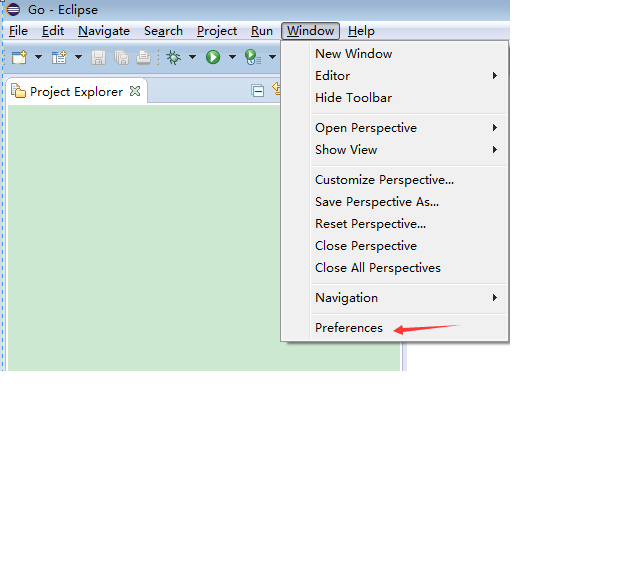  
>go get -u github.com/nsf/gocode (-u flag for "update")
>windows使用 go get -u -ldflags -H=windowsgui github.com/nsf/gocode
2. 配置golang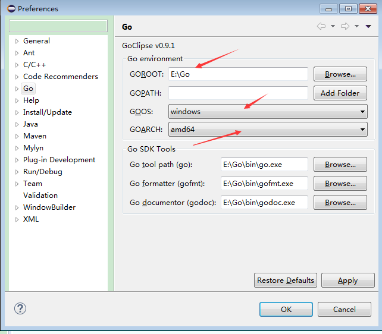 
3. 配置gocode（这个是编写代码时候的自动补全功能）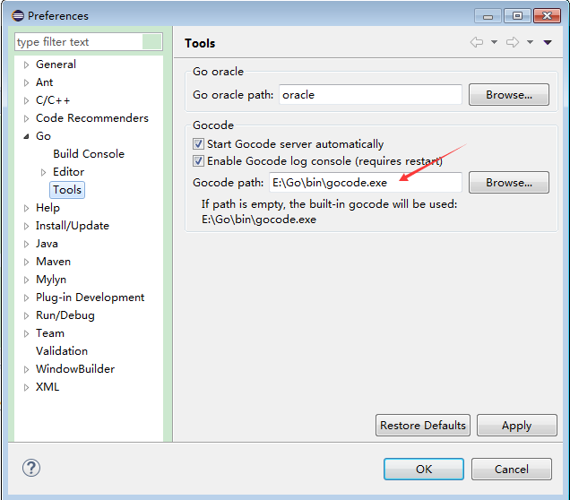

##经典实例HelloWorld
1.新建工程
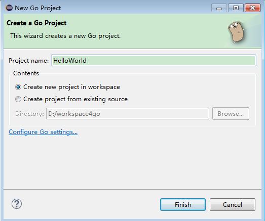   
2.在src目录下新建一个文件**在src建立go文件是无法被处理的**
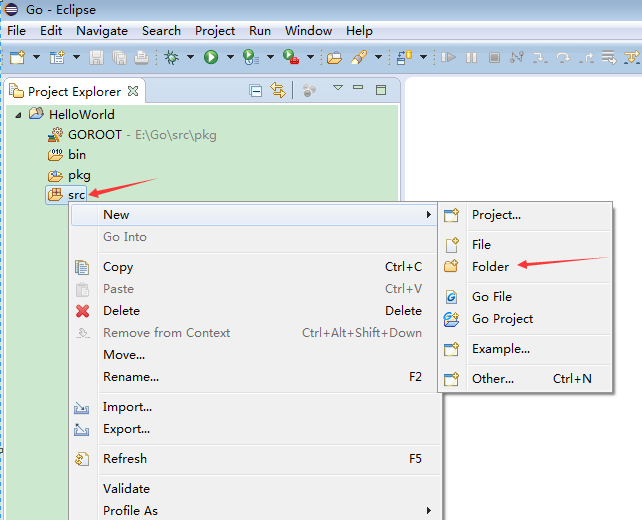    
3.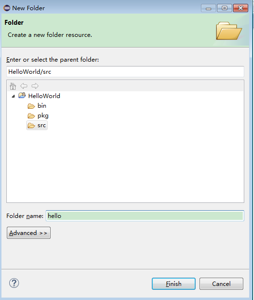   
4.新建一个go文件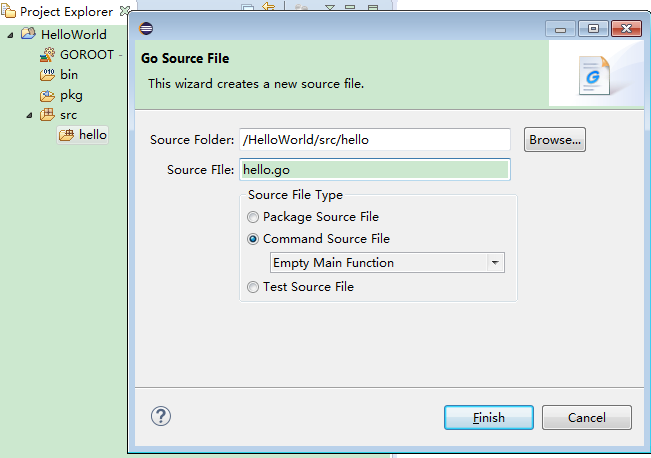   
5.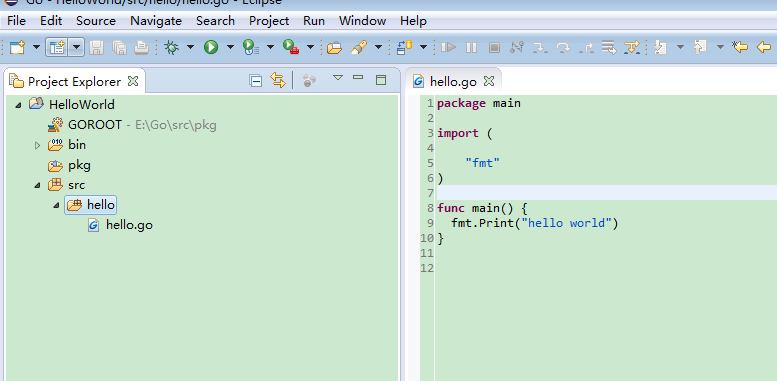   
6.
```
package main 
import (
    "fmt"
)
func main() {
  fmt.Print("hello world")
}  
```
7.运行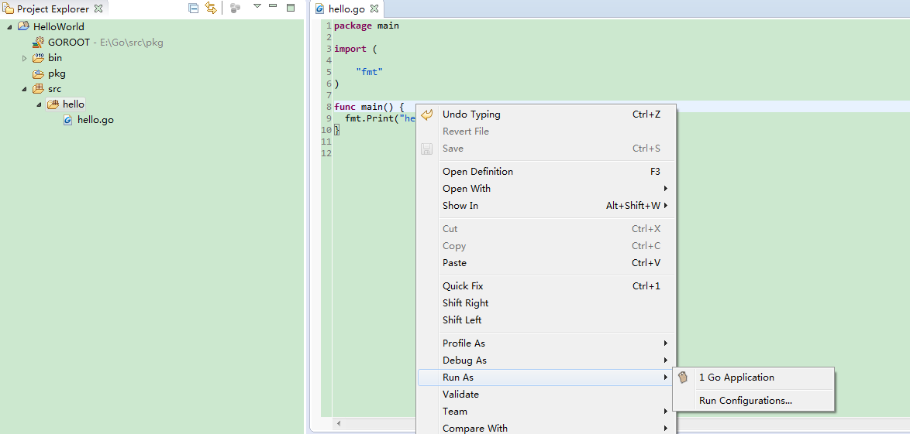结果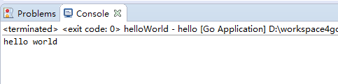  

###debug
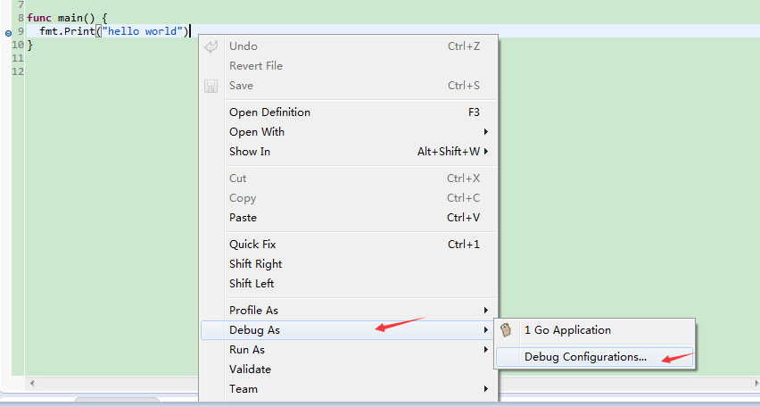
下载gdb
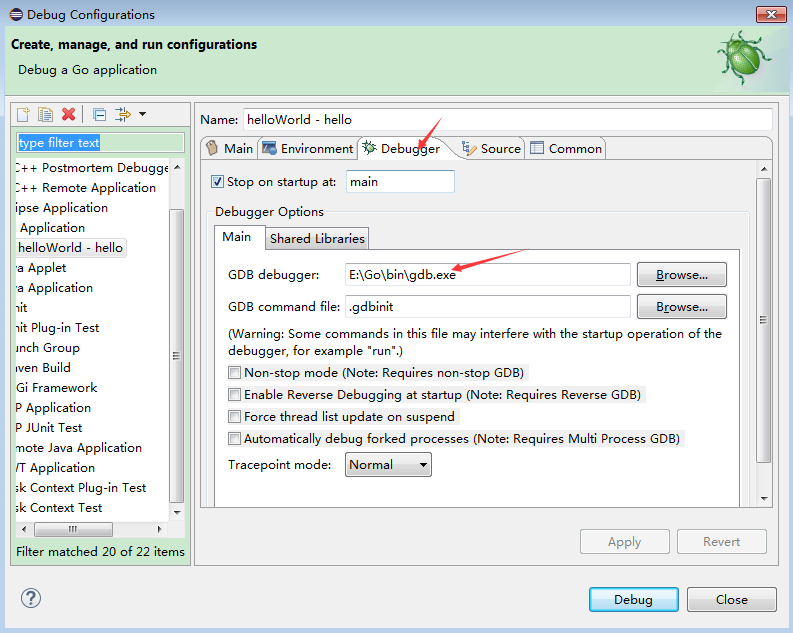

#基础
##变量
###变量定义
  使用关键字var 定义变量,自动初始化为零值.如果提供初始化值，可省略变量类型，由编译器自动推导。
```
var v1 int 
var v2 string 
var v3 [10]int  // 数组 
var v4 []int  // 数组切片 
var v5 struct { 
    f int 
} 
var v6 *int  // 指针 
var v7 map[string] int // map，key为string类型，value为int类型 
var v8 func(a int) int 
var v9 int = 10
var v10 = 10 //编译器可以自动推导出v10的类型 
v11 := 10 //编译器可以自动推导出v11的类型 
```
###多变量定义
```
var v1, v2, v3 int
var v4, v5 = "abc", 123
```
### 将变量放到一起
不能有“:=”的声明方式在里面
```
 var (
    v1 int
    v2 string
    v3 = 10
)
```
###变量赋值
多变量赋值时,从左到右依次赋值
```
var v4, v5 = "abc", 123
```
###golang多重赋值功能
如下面这个交换v1和v2变量的语句：
```
v1, v2 = v2, v1
```
不支持多重赋值功能的代码的语句
```
v3=v1,v1=v2,v2=v3
```
###匿名变量"_"用于忽略占位

我们在使用传统的强类型语言编程时，经常会出现这种情况，即在调用函数时为了获取一个
值，却因为该函数返回多个值而不得不定义一堆没用的变量。在Go中这种情况可以通过结合使
用多重返回和匿名变量来避免这种丑陋的写法，让代码看起来更加优雅。 
假设GetName()函数的定义如下，它返回3个值，分别为firstName、lastName和
nickName： 
```
func GetName() (firstName, lastName, nickName string) { 
 
return "May", "Chan", "Chibi Maruko" 
} 
```
若只想获得nickName，则函数调用语句可以用如下方式编写： 
_, _, nickName := GetName() 
这种用法可以让代码非常清晰，基本上屏蔽掉了可能混淆代码阅读者视线的内容，从而大幅
降低沟通的复杂度和代码维护的难度。 
会报错的代码
```
package main
import (
  "fmt"
)
func test() (int, string) {
	return 1, "rv1"
}
func main() {
	var v1 int //会报错： v1 declared and not used
	var v2 int
	fmt.Println(v2)
}
```
使用“_”占位屏蔽报错
```
package main
import (
  "fmt"
)
func test() (int, string) {
	return 1, "rv1"
}
func main() {
	var v1 int
	_=v1 //使用匿名变量规避 “v1 declared and not used”的报错
	var v2 int
	fmt.Println(v2)
}
```
###常量
定义:编译期可确定的数字、字符串、布尔值

>const v1 int=1  
const v2 = 2      // 无类型整型常量        
const ( 
    v3 int = 3 
    v4 = -1                // 无类型整型常量 
)  
const v5, v6 float32 = 0, 3    // v5 = 0.0, v6 = 3.0，
const v7, v8, v9 = 7, 8, "9str"
const v10=1<<2  //在编译期运算的常量表达式
const v11=os.Geteuid()//报错const initializer os.Geteuid() is not a constant**常量的赋值是一个编译期行为， 所以右值不能出现任何需要运行期才能得出结果的表达式**

在常量组中，如不提供类型和初始化值，那么视作与上一常量相同
```
const (
    v1 = "v1"
    v2 // v2 = "v1"
)
```
###预定义常量iota
定义:是一个可被编译器修改的常量，在每一个const关键字出现时被重置为0，然后在下一个const出现之前，每出现一次iota，其所代表的数字会自动增1。
```
 const (//const出现iota被重置为0
  v0 = iota //v0=0
	v1 = iota //v1=1
	v2 = iota //v2=2
)
const v3 = iota //const出现iota被重置为0 v3=0
const (  //const出现iota被重置为0
	v4 = iota //v4=0
	v5 //v5=1
	v6 //v6=2
)
```
在同一常量组中，可以提供多个iota，它们各自增长
```
const (
    v1, v2 = iota, iota+1   // v1=0, v2=1
    v3, v4    // v3=1,v4=2
)
      
```
如果iota被中断必须要显示回复

```
 const (
    v1   = iota      // v1=0
    v2               // v2=1
    v3   = "v3"       // v3="v3" 
    v4               // v4="v3"，与上一行相同。
    v5   = iota      // v5=4，显式恢复。注意计数包含了 v3,v4两行。
    v6               // v6=5
)
```
###枚举
定义:枚举是指指一系列相关的常量，比如性别
```
 const(
    Male = iota 
    Female
)
     
```
自定义类型来实现枚举类型限制
```
package main
import(
  "fmt")
type Sex int
const(
    Male Sex = iota 
    Female
	)
func  printSex(s Sex){
	fmt.Println(s)
	}
func main() {
	v1 := Male
	v2 := Female
	printSex(v1)
	printSex(v2)
	printSex(3)//常量会被编译器自动转换
	v3 :=1
	printSex(v3)//Error:cannot use v3 (type int) as type Sex in argument to printSex
}
```

##类型
Go语言内置以下这些基础类型：

+ 布尔类型：bool。 
+ 整型：int8、byte、int16、int、uint、uintptr等。 
+ 浮点类型：float32、float64。
+ 复数类型：complex64、complex128。 
+ 字符串：string。 
+ 字符类型：rune。 
+ 错误类型：error。

此外，Go语言也支持以下这些复合类型:

+ 指针（pointer） 
+ 数组（array） 
+ 切片（slice） 
+ 字典（map） 
+ 通道（chan） 
+ 结构体（struct） 
+ 接口（interface）

类型  |长度   |默认值|说明
------|-------|------|-------
bool       |1      | false||
byte       |1      | 0    |uint8|
rune       |4      | 0    |Unicode Code Point, int32|
int, uint  |4 或 8      | 0    |32 或 64 位|
int8, uint8       |1      | 0    |-128 ~ 127, 0 ~ 255|
int16, uint16      |2      | 0    |-32768 ~ 32767, 0 ~ 65535|
int32, uint32      |4      | 0    |-21亿 ~ 21 亿, 0 ~ 42 亿|
int64, uint64     |8      | 0    ||
float32     |4      | 0.0    ||
float64     |8      | 0.0    ||
complex64     |8      |     ||
complex128     |16      |     ||
uintptr     |4 或 8      |     |足以存储指针的 uint32 或 uint64 整数|
array     |      |     |值类型|
struct     |      |     |值类型|
string     |      | ""    |UTF-8 字符串|
slice     |      | nil    |引用类型| 
map     |      | nil    |引用类型| 
channel     |      | nil    |引用类型| 
interface     |      | nil    |接口| 
function     |      | nil    |函数| 

关于错误类型，我们会在“错误处理”一节中介绍；关于通道，我们会在4.5节中进一步介
绍；关于结构体和接口，我们则在第3章中进行详细的阐述。 
在这些基础类型之上Go还封装了下面这几种类型：int、uint和uintptr等。这些类型的
特点在于使用方便，但使用者不能对这些类型的长度做任何假设。对于常规的开发来说，用int
和uint就可以了，没必要用int8之类明确指定长度的类型，以免导致移植困难。


###布尔
Go语言中的布尔类型与其他语言基本一致，关键字也为bool，可赋值为预定义的true和
false示例代码如下： 
```
var v1 bool 
v1 = true 
v2 := (1 == 2) // v2也会被推导为bool类型 
```
布尔类型不能接受其他类型的赋值，不支持自动或强制的类型转换。以下的示例是一些错误
的用法，会导致编译错误： 
```
var b bool 
b = 1 // 编译错误 
b = bool(1) // 编译错误 
```
以下的用法才是正确的： 
```
var b bool 
b = (1!=0) // 编译正确  
fmt.Println("Result:", b) // 打印结果为Result: true
```
###整型
####1. 类型表示

需要注意的是，int和int32在Go语言里被认为是两种不同的类型，编译器也不会帮你自动
做类型转换，比如以下的例子会有编译错误： 
```
var value2 int32 
value1 := 64  
// value1将会被自动推导为int类型 
value2 = value1 // 编译错误 
```
编译错误类似于： 
cannot use value1 (type int) as type int32 in assignment。 
使用强制类型转换可以解决这个编译错误： 
value2 = int32(value1) // 编译通过 
当然，开发者在做强制类型转换时，需要注意数据长度被截短而发生的数据精度损失（比如
将浮点数强制转为整数）和值溢出（值超过转换的目标类型的值范围时）问题。

####2. 数值运算 

Go语言支持下面的常规整数运算：+、、*、/和%。加减乘除就不详细解释了，需要说下的
是，% 和在C语言中一样是求余运算，比如： 
5 % 3 // 结果为：2 

####3. 比较运算 

Go语言支持以下的几种比较运算符：>、<、==、>=、<=和!=。这一点与大多数其他语言相
同，与C语言完全一致。 
下面为条件判断语句的例子： 
```
i, j := 1, 2  
if i == j { 
    fmt.Println("i and j are equal.")  
}
```
两个不同类型的整型数不能直接比较，比如int8类型的数和int类型的数不能直接比较，但
各种类型的整型变量都可以直接与字面常量（literal）进行比较，比如：
```
var i int32 
var j int64 
 
i, j = 1, 2 
 
if i == j {   
// 编译错误 
    fmt.Println("i and j are equal.")  
}   
 
if i == 1 || j == 2 { // 编译通过 
    fmt.Println("i and j are equal.")  
} 
```
####4. 位运算 
Go语言支持表2-2所示的位运算符


运  算|含  义|样  例 |结果
------|------|------|------
x << y |左移|124 << 2|结果为496 
x >> y |右移 |124 >> 2  |结果为31
x ^ y|异或 |124 ^ 2 |126 
x & y |与|124 & 2 |0
x | y |或|124 \| 2  |126
^x|取反|^2|3 
###浮点型 
浮点型用于表示包含小数点的数据，比如1.234就是一个浮点型数据。Go语言中的浮点类型
采用IEEE-754标准的表达方式。
#常见错误
##go: missing Git command
处理办法，把git的bin路径加入环境变量Path中。
我的路径是：C:\Program Files (x86)\Git\bin


